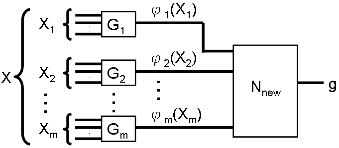
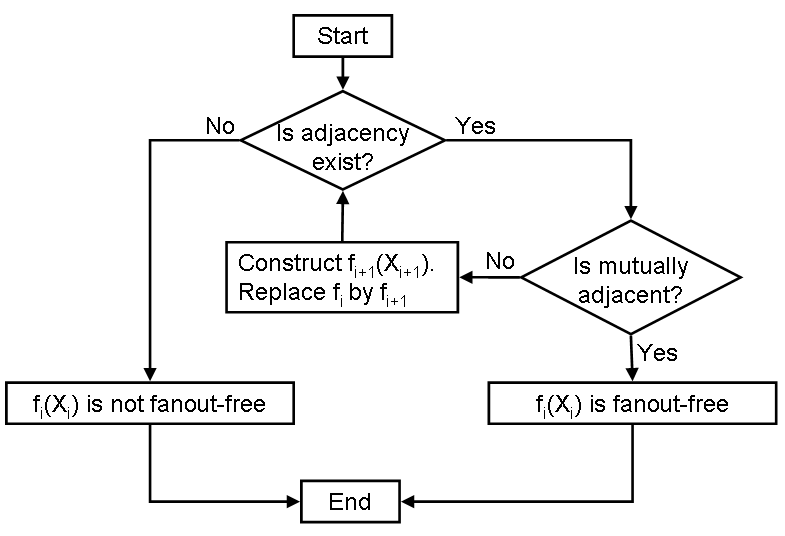
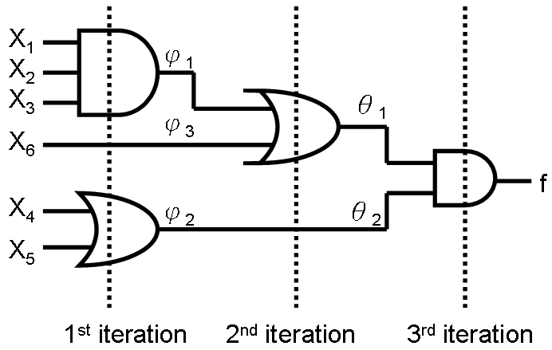
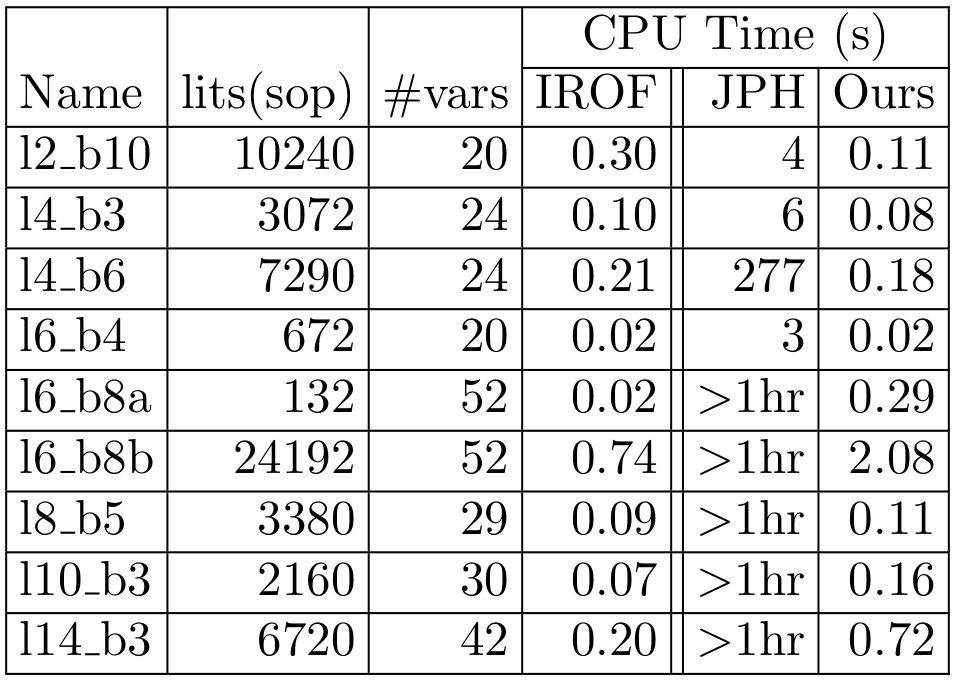

## Outline

- [Preliminaries](#preliminaries)
- [The Old Algorithm](#the-old-algorithm)
- [The New Algorithm](#the-new-algorithm)
- [Complexity and Performance](#complexity-and-performance)

# Preliminaries

## Task: Recognize Fanout-free Functions

- $f$ is fanout-free

  $\Leftrightarrow\exists$ form where each variable appears exactly once

  - $f = x_1x_2 + x_1x_3$ is fanout-free

    ($f = x_1(x_2 + x_3)$)
  
  - $f = x_1x_2 + x_2x_3 + x_3x_1$ is NOT fanout-free

- Task: Given $f$ in SOP form
  1. Is $f$ fanout-free?
  2. If true, find a fanout-free form of $f$

- Assume variables are positive

  If not, $f(x_i) = \overline{x_i}\dots \Rightarrow g(\overline{x_i}) = x_i\dots$

<!-- ## Unate function

- $f$ is **positive unate** in $x_i$

  $\Leftrightarrow f(x_i = \textcolor{red}{0}) = 1$ implies $f(x_i = \textcolor{red}{1}) = 1$

  - i.e. $x_i$ only need to appear as $\dots x_i \dots$ in $f$

- $f$ is **negative unate** in $x_i$

  $\Leftrightarrow f(x_i = \textcolor{red}{1}) = 1$ implies $f(x_i = \textcolor{red}{0}) = 1$

  - i.e. $x_i$ only need to appear as $\dots \overline{x_i} \dots$ in $f$

- $f(X)$ is **unate** if $f$ is pos / neg unate in all $x_i \in X$

- Fanout-free implies unate -->

## Adjacency

- $x_i$ and $x_j$ are **adjacent** in $f$

  $\Leftrightarrow f(x_i = a) = f(x_j = a)$, for some $a = 0$ or $1$

- Notation: $x_i =_a x_j$
- Proven to be an equivalence relation

$f = x_1x_2x_3x_4 + x_1x_2x_3x_5 + x_4x_6 + x_5x_6$

$\implies \textcolor{red}{x_1 =_0 x_2 =_0 x_3}, \; \textcolor{blue}{x_4 =_1 x_5}$

$\implies \text{adjacent classes: } \textcolor{red}{\{x_1, x_2, x_3\}} \textcolor{blue}{\{x_4, x_5\}} \{x_6\}$

# The Old Algorithm

## JPH's Procedure

Theorem: Given the adjacency partition $\{X_1, \dots, X_m\}$ for $X$

we can decompose $f$ like this:

The procedure recursively decompose $f$,

until $g$ is **mutually adjacent**

## JPH's Procedure (cont'd)

## Why is JPH's Procedure slow?

1. Recall $x_i =_a x_j$ iff the cofactors are the same.
   
   Requires **equivalence checking** of two functions.

2. The new function $g$ is found by building **truth table**.

$\implies$ Exponential time.

# The New Algorithm

## Disappearance and Adjacency

### Lemma 1

Adjacency $\implies$ disappearance

$x_i =_a x_j \implies \begin{cases}x_j \text{ disappears in } f(x_i = a) \\ x_i \text{ disappears in } f(x_j = a)\end{cases}$

### Lemma 2

Disappearance $\implies$ adjacency

$\begin{cases}x_j \text{ disappears in } f(x_i = a) \\ x_i \text{ disappears in } f(x_j = a)\end{cases} \implies x_i =_a x_j$

### Theorem

Adjacency $\Leftrightarrow$ disappearance

$\implies$ *Check disappearance (polynomial time) to check adjacency*

## Example: Use disappearance to check adjacency

$f = x_1x_2x_3x_4+x_1x_2x_3x_5+x_4x_6+x_5x_6$

Compute cofactors.

$\begin{cases}
f(x_1 = 0) = x_4x_6+x_5x_6\\
f(x_2 = 0) = x_4x_6+x_5x_6\\
f(x_3 = 0) = x_4x_6+x_5x_6\\
f(x_4 = 0) = x_1x_2x_3x_5+x_5x_6\\
f(x_5 = 0) = x_1x_2x_3x_4+x_4x_6\\
f(x_6 = 0) = x_1x_2x_3x_4+x_1x_2x_3x_5
\end{cases}$

## {.plain}

$\begin{cases}
f(x_1 = 0) = x_4x_6+x_5x_6\\
f(x_2 = 0) = x_4x_6+x_5x_6\\
f(x_3 = 0) = x_4x_6+x_5x_6\\
f(x_4 = 0) = x_1x_2x_3x_5+x_5x_6\\
f(x_5 = 0) = x_1x_2x_3x_4+x_4x_6\\
f(x_6 = 0) = x_1x_2x_3x_4+x_1x_2x_3x_5
\end{cases}$

$\begin{matrix}
& x_1 & x_2 & x_3 & x_4 & x_5 & x_6\\
f(x_1 = 0) & \textcolor{gray}{0} & \textcolor{red}{0} & \textcolor{red}{0} & 1 & 1 & 1\\
f(x_2 = 0) & \textcolor{red}{0} & \textcolor{gray}{0} & 0 & 1 & 1 & 1\\
f(x_3 = 0) & \textcolor{red}{0} & 0 & \textcolor{gray}{0} & 1 & 1 & 1\\
f(x_4 = 0) & 1 & 1 & 1 & \textcolor{gray}{0} & 1 & 1\\
f(x_5 = 0) & 1 & 1 & 1 & 1 & \textcolor{gray}{0} & 1\\
f(x_6 = 0) & 1 & 1 & 1 & 1 & 1 & \textcolor{gray}{0}
\end{matrix} \implies x_1 =_0 x_2 =_0 x_3$

## Example: Find new function $g$

### Find all adjacency classes

Repeat for $f(x_i = 1)$, we find $x_4 =_1 x_5$

$\implies \text{adjacent classes: } \textcolor{red}{\{x_1, x_2, x_3\}} \textcolor{blue}{\{x_4, x_5\}} \{x_6\}$

$\implies \phi_1 = \textcolor{red}{x_1x_2x_3}$, $\phi_2 = \textcolor{blue}{(x_4+x_5)}$, $\phi_3 = x_6$

### Deduce $g$

$\begin{aligned}
&{} f(x_1, x_2, x_3, x_4, x_5, x_6) = \textcolor{red}{x_1x_2x_3}\textcolor{blue}{x_4}+\textcolor{red}{x_1x_2x_3}\textcolor{blue}{x_5}+\textcolor{blue}{x_4}x_6+\textcolor{blue}{x_5}x_6\\
& = g(\phi_1, \phi_2, \phi_3) = \textcolor{red}{\phi_1}\textcolor{blue}{\phi_2} + \textcolor{blue}{\phi_2}\phi_3\\
\\
& = f(\phi_1, \phi_1, \phi_1, \phi_2, \phi_2, \phi_3) = \textcolor{red}{\phi_1\phi_1\phi_1}\textcolor{blue}{\phi_2}+\textcolor{red}{\phi_1\phi_1\phi_1}\textcolor{blue}{\phi_2}+\textcolor{blue}{\phi_2}\phi_3+\textcolor{blue}{\phi_2}\phi_3
\end{aligned}$

(This is **not** a coincidence)

## Example

After repeating the process (find adj. classes, deduce new function),

$h(\theta_1, \theta_2) = \theta_1\theta_2$

Only one adjacency class $\{\theta_1, \theta_2\} \implies$ $f$ is fanout-less

# Complexity and Performance

## {.plain}

### Complexity

$N =$ number of variables, $K =$ number of products (in SOP form)

- JPH's procedure: $O(N^2\textcolor{red}{2^N})$, due to equivalence check
- Proposed method: $O(N^2K)$

### Performance

## References

- T. Lee and C. Wang, "Recognition of Fanout-free Functions,"

<!-- vim: set ft=markdown.pandoc colorcolumn=100: -->
