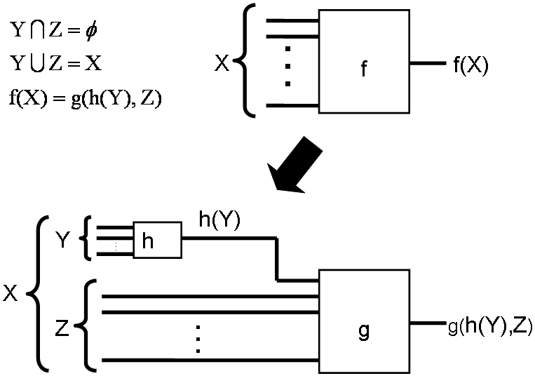

## Outline

- [Preliminaries](#preliminaries)
- [The Algorithm](#the-algorithm)

# Preliminaries

## Task: Recognize Fanout-free Functions

- $f$ is fanout-free

  $\Leftrightarrow\exists$ form where each variable appears exactly once

  - $f = x_1x_2 + x_1x_3$ is fanout-free, because $x_1(x_2 + x_3)$
  
  - $f = \textcolor{red}{x_1}x_2 + \textcolor{red}{\overline{x_1}}x_3$ is NOT fanout-free

- Task: Given $f$ in SOP form
  1. Is $f$ fanout-free?
  2. If true, find a fanout-free form of $f$

<!-- ## Unate function

- $f$ is **positive unate** in $x_i$

  $\Leftrightarrow f(x_i = \textcolor{red}{0}) = 1$ implies $f(x_i = \textcolor{red}{1}) = 1$

  - i.e. $x_i$ only need to appear as $\dots x_i \dots$ in $f$

- $f$ is **negative unate** in $x_i$

  $\Leftrightarrow f(x_i = \textcolor{red}{1}) = 1$ implies $f(x_i = \textcolor{red}{0}) = 1$

  - i.e. $x_i$ only need to appear as $\dots \overline{x_i} \dots$ in $f$

- $f(X)$ is **unate** if $f$ is pos / neg unate in all $x_i \in X$

- Fanout-free implies unate -->

## Adjacency

- $x_i$ and $x_j$ are **adjacent**

  $\Leftrightarrow f(x_i = a) = f(x_j = a)$, for some $a = 0$ or $1$

- i.e. $\exists$ the same cofactor for both vars
- Notation: $x_i =_a x_j$
- Proven to be an equivalence relation

$f = x_1x_2x_3x_4 + x_1x_2x_3x_5 + x_4x_6 + x_5x_6$

$\implies \textcolor{red}{x_1 =_0 x_2 =_0 x_3}, \; \textcolor{blue}{x_4 =_1 x_5}$

$\implies \text{adjacent classes: } \textcolor{red}{\{x_1, x_2, x_3\}} \textcolor{blue}{\{x_4, x_5\}} \{x_6\}$

# The Old Algorithm

## Simple Disjunctive Decomposition

$\{Y, Z\}$ must be a partition of $X$.

## JPH's Procedure

Theorem: Given the adjacency partition $\{X_1, \dots, X_m\}$ for $X$

we can decompose $f$ like this:

The procedure recursively decompose $f$,

until $g$ is **mutually adjacent**

## JPH's Procedure (cont'd)

## Why is JPH's Procedure slow?

1. Recall $x_i =_a x_j$ iff the cofactors are the same.
   
   Requires **equivalence checking** of two functions.

2. The new function $g$ is found by building **truth table**.

$\implies$ Exponential time.

# The New Algorithm

## Disappearance and Adjacency

### Lemma 1

Adjacency $\implies$ disappearance

$x_i =_a x_j \implies \begin{cases}x_j \text{ disappears in } f(x_i = a) \\ x_i \text{ disappears in } f(x_j = a)\end{cases}$

### Lemma 2

Disappearance $\implies$ adjacency

$\begin{cases}x_j \text{ disappears in } f(x_i = a) \\ x_i \text{ disappears in } f(x_j = a)\end{cases} \implies x_i =_a x_j$

### Theorem

Adjacency $\Leftrightarrow$ disappearance

$\implies$ *Check disappearance (polynomial time) to check adjacency*

## Example: Use disappearance to check adjacency

<!-- vim: set ft=markdown.pandoc colorcolumn=100: -->
